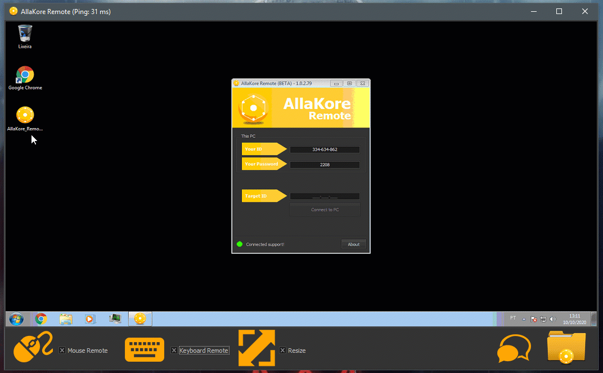

	This source has created by Maickonn Richard & Gabriel Stilben.
	Any questions, contact-me: maickonnrichard@gmail.com

	My Github: https://www.github.com/Maickonn
	
	Join our Facebook group: https://www.facebook.com/groups/1202680153082328/

	AllaKore Remote is a Remote Access software open source written in Delphi Seattle.

-----------------------------------------------------------------------

First of all, I apologize for my English because it is not my native language. I live in Brazil. :D

----
**All components used are native to Delphi itself.**

**Now the project is 100% compatible with Delphi Seattle.**
----

<strong>There are some observations to be taken before opening the project:</strong>

* The software requires a central server, I recommend host it on a server inside your country, so there is a low latency.
* Like any BETA project, this is subject to bugs that will be corrected over time. I count on the cooperation of all.
* If they can solve any problem, just send the solution that it will be posted.
* The function of the server is to route all data traffic, delivering each packet to the correct user. The server forwards the packets as soon as they are received to gain performance.
* On the Client project, the unit has two Form_Main constant calls "Host" and "Port". In the constant "Host" you must enter the DNS or IP address of your server. In the constant "Port" you should enter the port that was chosen in the constant of the "Server".

<strong>AllaKore Remote has the following functions:</strong>

* Connection ID and Password.
* Remote access with RFB algorithm (Send only what has changed on the screen).
* Data Compression (zLib).
* Sharer files.
* Chat.
* UAC Interaction.

---

<strong>DEMO</strong>

<strong>UAC Interaction DEMO</strong>
